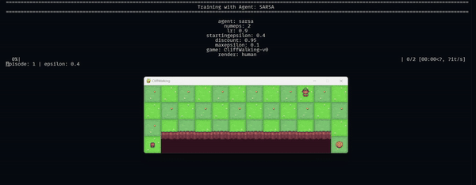

## TD learning implementation

This repo implements Q-learning, SARSA and Expected SARSA on the cliffwalking reinforcement learning problem. Also includes Double-Q-Learning. 

-------------------

To run the repo, download [uv](https://docs.astral.sh/uv/) and run the following command:

```bash
uv venv
source .venv/bin/activate # .venv\Scripts\activate on Win
uv sync
```

This will install the following packages:

* Numpy
* gymnasium
* tqdm

----- 

<code>train.py</code> trains an agent based on passed CLI parameters.

<code>td_learning.py</code> contains the classes for the different types of agents. 

An example of training can be seen below:



Trained agents can also be tested with 

```bash
python3 src/main.py -t -f {FILE_NAME}
```

